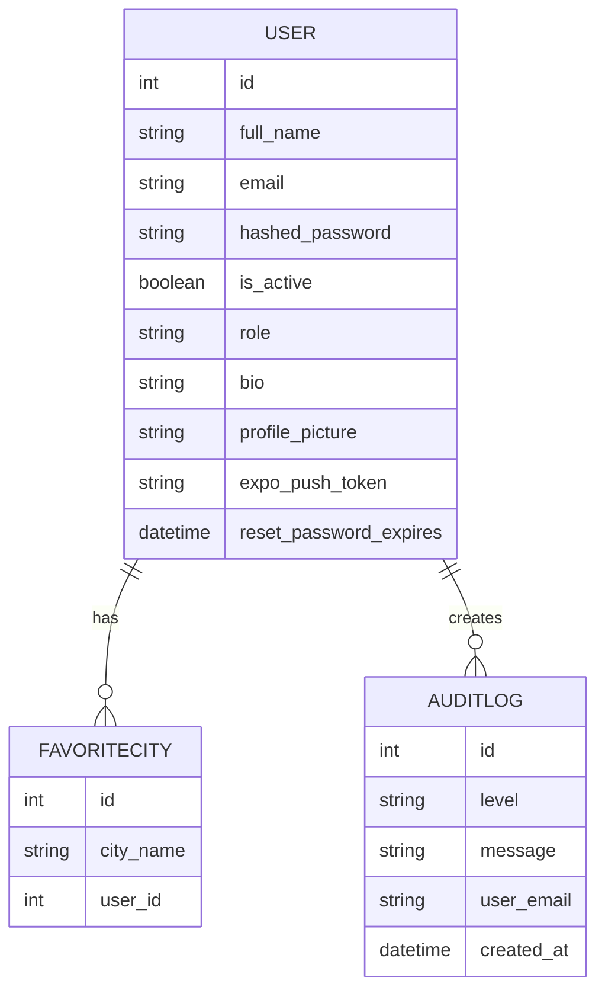

## Ubicacion

```text
backend/
|-- app/
|   |-- main.py
|   |-- database.py
|   |-- models.py
|   |-- schemas.py
|   |-- auth.py
|   `-- routers/
|       |-- users.py
|       `-- weather.py
|-- requirements.txt
`-- scripts/
    `-- seed.py
```

## Responsabilidades

El backend centraliza:

- Autenticacion con JWT.
- Hash de contrasenas con `passlib` y `bcrypt`.
- Persistencia con SQLAlchemy.
- Usuarios, roles, avatars y tokens push.
- Favoritos de ciudades.
- Consultas a OpenWeather.
- Logs de auditoria.
- Archivos estaticos para avatars en `/static`.

## Entrada Principal

El archivo `backend/app/main.py` crea la aplicacion FastAPI:

```python
app = FastAPI(title="WeatherApp API")
app.mount("/static", StaticFiles(directory="static"), name="static")
app.include_router(users.router)
app.include_router(weather.router)
```

Tambien configura CORS para desarrollo local con Expo, Vite y navegadores.

## Base de Datos

El proyecto usa SQLite local:

```python
SQLALCHEMY_DATABASE_URL = "sqlite:///./data/weather_app.db"
```

Los modelos se crean automaticamente al iniciar el backend mediante:

```python
Base.metadata.create_all(bind=engine)
```

### Modelos Principales

| Modelo         | Tabla        | Descripcion                                                                         |
| -------------- | ------------ | ----------------------------------------------------------------------------------- |
| `User`         | `users`      | Usuario, credenciales, rol, bio, avatar, token push, token de reset y estado activo |
| `FavoriteCity` | `favorites`  | Ciudad favorita normalizada por usuario                                             |
| `AuditLog`     | `audit_logs` | Evento de auditoría con nivel, mensaje, email y fecha                               |

## Estado de cuenta

El modelo `User` ahora incluye el campo `is_active` para suspender o reactivar usuarios sin eliminarlos. Esto permite que el administrador bloquee temporalmente una cuenta y mantenga sus favoritos y auditoría.

## Diagrama Entidad-Relación



La relación entre `User` y `FavoriteCity` está definida con un `ForeignKey` y una restricción de unicidad por `user_id` y `city_name`. Esto asegura que cada usuario no pueda guardar la misma ciudad favorita más de una vez.

## Endpoints administrativos nuevos

El backend incluye ahora rutas que sólo puede usar un administrador autenticado.

- `GET /users` — Lista todos los usuarios.
- `PUT /users/{user_id}` — Actualiza datos de un usuario desde el panel admin.
- `PATCH /users/{user_id}/status` — Suspende o reactiva una cuenta.
- `DELETE /users/{user_id}` — Elimina de forma permanente un usuario.

Estas operaciones generan eventos de auditoría para que el panel admin pueda revisar cambios sensibles.

## Auditoría y seguridad

El router de usuarios registra eventos clave en `AuditLog`:

- `AUTH` para inicios de sesión exitosos y cambios de contraseña.
- `WARN` para intentos de login fallidos, cambios administrativos y suspensión de cuentas.
- `ERROR` para eliminaciones de usuario.

La función `log_event()` centraliza esta persistencia.

## Variables de Entorno

El backend lee variables desde `.env` usando `python-dotenv`.

| Variable              | Uso                                      |
| --------------------- | ---------------------------------------- |
| `OPENWEATHER_API_KEY` | API key para consultar OpenWeather       |
| `SECRET_KEY`          | Llave para firmar tokens JWT             |
| `ENVIRONMENT`         | Si es `production`, limita origenes CORS |

Ejemplo:

```bash
OPENWEATHER_API_KEY=tu_api_key
SECRET_KEY=una_clave_larga_y_privada
ENVIRONMENT=development
```

## Archivos Estaticos

Los avatars se guardan localmente en:

```text
backend/static/avatars/
```

El backend expone esos archivos con rutas publicas relativas como:

```text
/static/avatars/user_1_ab12cd34.png
```

Para produccion, conviene mover estas imagenes a almacenamiento externo como S3, Cloudinary o Firebase Storage.

## Script de Seed

El script `backend/scripts/seed.py` crea un usuario admin y un usuario de prueba para desarrollo local.

```bash
cd backend
python3 scripts/seed.py
```

Revisa los correos y contrasenas dentro del script antes de usarlo.
