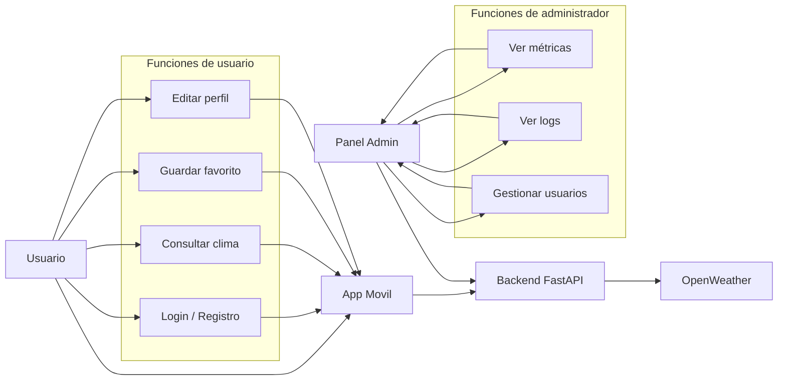
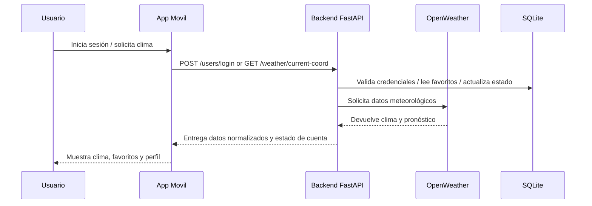

## Introducción

WeatherApp es una plataforma multiplataforma pensada para entregar información meteorológica confiable, personalizada y fácil de usar. El proyecto une una API moderna, una app móvil y un panel administrativo para ofrecer una solución completa al cliente.

WeatherApp resuelve la necesidad de obtener clima local y por ciudad con una experiencia de usuario fluida, registro de usuarios, gestión de favoritos, edición de perfil y monitoreo administrativo.

## Planteamiento del problema

Las personas necesitan una solución de clima que vaya más allá de mostrar una temperatura. El reto es ofrecer:

- Datos meteorológicos precisos desde un proveedor externo.
- Búsqueda de ciudades y geolocalización para el clima actual.
- Gestión de usuarios con autenticación segura.
- Un panel administrativo para supervisar el uso y el estado de la aplicación.
- Soporte para notificaciones push en builds nativos.

WeatherApp responde a estos retos con una arquitectura desacoplada y una experiencia coherente en todos los componentes.

## Objetivo general

Desarrollar una aplicación de clima integral que combine:

- una API REST segura y escalable,
- una app móvil Expo/React Native con acceso a ubicación y notificaciones,
- un panel administrativo web para métricas, logs y control de usuarios.

## Objetivos específicos

- Implementar autenticación y roles de usuario con JWT.
- Permitir registro, login, recuperación de contraseña y edición de perfil.
- Gestionar ciudades favoritas por usuario.
- Consultar datos meteorológicos en tiempo real usando OpenWeather.
- Almacenar avatars y permitir su visualización desde la app.
- Registrar eventos de auditoría y mostrar logs en el panel admin.
- Preparar builds nativos con soporte para notificaciones push.

## Requerimientos

### Requerimientos funcionales

- Registro y login de usuarios.
- Recuperación de contraseña.
- Edición de perfil y avatar.
- Consulta de clima por ubicación y por ciudad.
- Guardado de ciudades favoritas.
- Panel administrativo con métricas, logs y gráficos.
- Envío y almacenamiento de tokens de notificaciones push.

### Requerimientos técnicos

- Backend desarrollado en FastAPI.
- Persistencia local con SQLAlchemy y SQLite.
- App móvil construida con Expo Router y React Native.
- Panel administrativo construido con React, Vite y Tailwind CSS.
- Integración con OpenWeather y Expo Notifications.
- Uso de JWT para asegurar endpoints.

### Requerimientos de infraestructura

- Backend accesible en la red local para pruebas móviles.
- Variables de entorno para `OPENWEATHER_API_KEY`, `SECRET_KEY` y `ENVIRONMENT`.
- Configuración EAS y `google-services.json` para builds Android.
- Carpeta de datos `backend/data` y archivos estáticos en `backend/static`.

## Alcance actual

La documentación y el proyecto actual cubren:

- Autenticación y roles (usuario/admin).
- Gestión de usuarios, avatars y perfiles.
- Consulta de clima por ubicación y por búsqueda.
- Guardado de favoritos.
- Dashboard administrativo con métricas y gráficos.
- Registro de auditoría y logs.
- Soporte inicial para notificaciones push en builds nativos.
- Documentación técnica organizada para presentación.

## Beneficios para el cliente

- Visibilidad de uso y métricas del sistema.
- Experiencia móvil moderna y segura.
- Control administrativo desde un panel web.
- Base sólida para futuras mejoras y despliegues en producción.

## Diagramas

### Diagrama de casos de uso

### Diagrama de flujo de interacción

