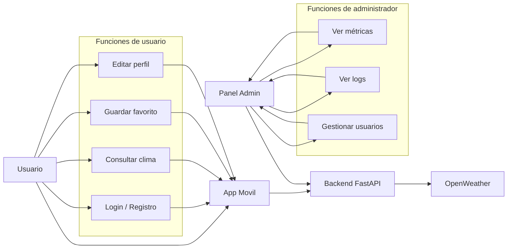
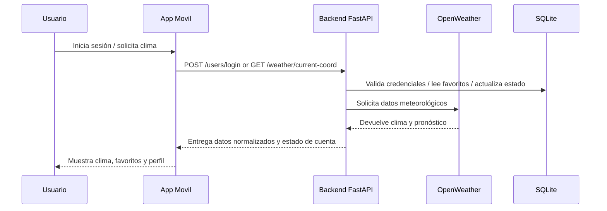
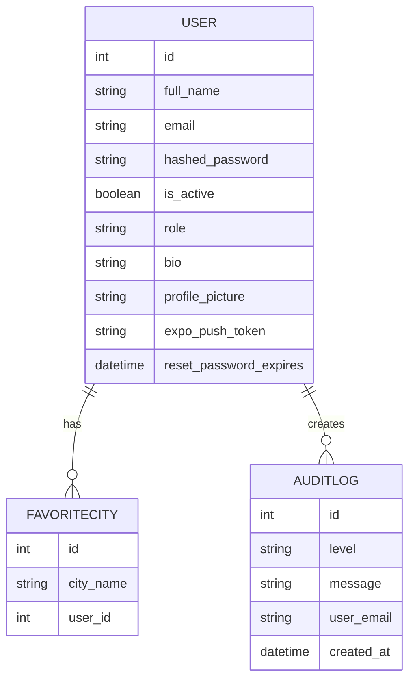

## Objetivo

Esta página reúne los diagramas visuales clave para presentar la arquitectura de WeatherApp de forma clara y profesional.

## Diagrama de casos de uso

## Diagrama de flujo de interacción

## Diagrama entidad-relación

## Notas de presentación

- El diagrama de casos de uso muestra la separación entre la experiencia del usuario móvil y la administración del sistema.
- El diagrama de flujo explica cómo la app utiliza el backend y OpenWeather para entregar datos meteorológicos.
- El diagrama ER resume la estructura de la base de datos y las relaciones entre usuarios, favoritos y auditoría.
